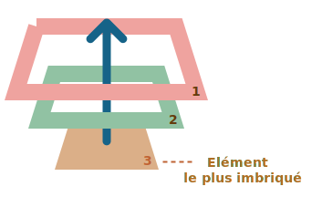
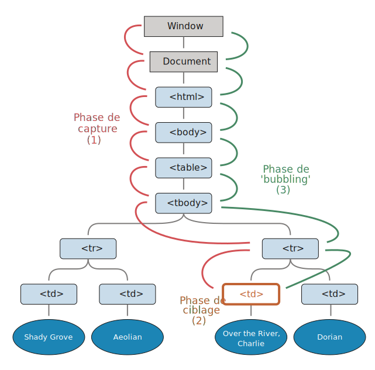

# Bubbling et capture

Commençons par un exemple.

Ce gestionnaire d'événement est assigné au `<div>`, mais s'exécute également si on clique sur l'un des sous-éléments comme `<em>` ou `<code>`:

```html autorun height=60
<div onclick="alert('The handler!')">
  <em>Si on clique sur l'<code>EM</code>, le gestionnaire du <code>DIV</code> s'exécute.</em>
</div>
```

Ce n'est pas un peu étrange ? Pourquoi le gestionnaire du `<div>` s'exécute alors qu'on a cliqué sur l'`<em>`?

## Bubbling (ou "bouillonement")

Le principe du 'bubbling' est simple.

**Quand un événement se produit sur un élément, il exécute d'abord les gestionnaires ('handlers') sur cet élément, puis sur son parent, puis remonte toute la chaîne d'ancêtres.**

Disons qu'on a 3 éléments imbriqués `FORM > DIV > P` qui ont chacun un gestionnaire associé:

```html run autorun
<style>
  body * {
    margin: 10px;
    border: 1px solid blue;
  }
</style>

<form onclick="alert('form')">FORM
  <div onclick="alert('div')">DIV
    <p onclick="alert('p')">P</p>
  </div>
</form>
```

Un clic sur le `<p>` interne exécute `onclick`:
1. Sur ce `<p>`.
2. Puis sur le `<div>`.
3. Puis sur le `<form>` externe.
4. Et continue jusqu'à atteindre l'objet `document`.



Si on clique donc sur `<p>`, on verra 3 alertes: `p` -> `div` -> `form`.

Ce fonctionnement s'appelle 'bubbling' (ou "bouillonnement"), car les événements remontent petit à petit, comme des bulles dans l'eau.

```warn header="*Presque* tous les événements 'bubble'."
Le mot-clé étant "presque".

Par exemple, un événement `focus` ne bubble pas. Il y a d'autres exemples également, nous y viendrons. Cela reste cependant une exception, pas la norme, la majorité des événements 'bubble'.
```

## event.target

Le gestionnaire d'événement sur un parent peut toujours récupérer les détails de la source initiale de l'événement, l'élément où l'événement s'est produit en premier.

**L'élement le plus imbriqué ayant causé l'événement s'appelle l'élément *cible*, accessible en tant que `event.target`.**

Notez la différence avec `this` (=`event.currentTarget`):

- `event.target` -- C'est l'élément "cible" qui a initié l'événement, il ne change pas au cours du 'bubbling' sur les parents.
- `this` -- C'est l'élément "actuel", celui qui a actuellement un gestionnaire en cours d'exécution.

Par exemple, si on a un seul gestionnaire `form.onclick`, il peut "attraper" n'importe quel clic à l'intérieur du formulaire. Peu importe sur quel sous-élément le clic a eu lieu dans le formulaire, il va 'bubble' jusqu'au `<form>` et exécuter son gestionnaire.

Dans un gestionnaire `form.onclick` :

- `this` (=`event.currentTarget`) est l'élément `<form>`, car le gestionnaire s'exécute dessus.
- `event.target` est le 'vrai' élément à l'intérieur du formulaire qui a été cliqué.

Démonstration:

[codetabs height=220 src="bubble-target"]

Il est possible que `event.target` ait la même valeur que `this` -- ça se produit si le clic est fait directement sur l'élément `<form>`.

## Stopper le bubbling

Un événement 'bubbling' remonte de l'élément cible en ligne droite vers le haut. Normalement, il remonte jusqu'à `<html>`, puis à l'objet `document`, et certains événements atteignent même `window`, en déclenchant tous les gestionnaires sur leur chemin.

Mais chaque gestionnaire peut décider que l'événement a été traité complètement, et interrompre le 'bubbling'.

On peut pour ça appeler `event.stopPropagation()`.

Ici par exemple, `body.onclick` ne fonctionne pas si on clique sur le `<button>`:

```html run autorun height=60
<body onclick="alert(`le bubbling n'atteint pas cet élément`)">
  <button onclick="event.stopPropagation()">Click me</button>
</body>
```

```smart header="event.stopImmediatePropagation()"
Si un élément a plusieurs gestionnaires pour un même événement, et que l'un d'entre eux stoppe le 'bubbling', les autres gestionnaires s'exécutent quand même.

En d'autres termes, `event.stopPropagation()` bloque seulement la remontée vers les parents, mais tous les gestionnaires s'exécuteront sur l'élément actuel.

Pour stopper le 'bubbling' et empêcher les gestionnaires sur l'élément actuel de s'exécuter, il existe une méthode `event.stopImmediatePropagation()`. Après l'avoir appelée, aucun autre gestionnaire ne s'exécutera.
```

```warn header="Ne stoppez pas le 'bubbling' si ce n'est pas nécessaire!"
Le 'bubbling' est utile, ne le stoppez pas sans en avoir le besoin technique ou architectural.

Parfois, même `event.stopPropagation()` crée des pièges cachés qui deviennent des problèmes plus tard.

Par exemple:

1. On crée un menu principal contenant des sous-menus. Chaque sous-menu gère les clics de ses sous-éléments et appelle la méthode `stopPropagation` pour ne pas propager l'événement au menu principal.
2. Plus tard, on décide de traquer tous les clics sur la fenêtre, pour suivre le comportement des utilisateurs (où ils cliquent). Certains systèmes de récolte de données analytiques font exactement ça. Ils utilisent souvent `document.addEventListener('click'…)` pour récupérer tous les clics.
3. Nos données analytiques seront manquantes pour la zone de la fenêtre où les clics sont stoppés par `stopPropagation`. Malheureusement, on vient de créer une "zone morte".

Il n'y a généralement pas besoin de bloquer le 'bubbling'. Un problème qui semble nécessiter un tel blocage peut très souvent être résolu par d'autres moyens. L'un d'entre eux est l'utilisation d'événements personnalisés, que nous verrons plus tard. On peut aussi écrire des données dans l'objet `event` depuis un gestionnaire, et les lire depuis un autre gestionnaire; on peut ainsi transmettre des données relatives à l'élément cible aux gestionnaires des éléments parents.
```


## Capture

Il y a une autre phase de traitement des événements appelée "capture". Elle est rarement utilisée en pratique, mais peut être utile.

Le standard [Evénements du DOM](https://www.w3.org/TR/DOM-Level-3-Events/) décrit les 3 phases de la propagation d'événement:

1. Phase de capture -- l'événement descend sur l'élément.
2. Phase de ciblage -- l'événement a atteint l'élément cible.
3. Phase de 'bubbling' -- l'événement remonte depuis l'élément.

Voici le schéma de la spécification des phases de capture `(1)`, ciblage `(2)` et 'bubbling' `(3)` pour un événement de clic sur un `<td>` dans une `<table>`:



Pour un clic sur le `<td>`, l'événement descend d'abord toute la chaîne d'ancêtres jusqu'à l'élément (phase de capture), puis se 'fixe' à la cible et se déclenche ici (phase de ciblage), et enfin remonte (phase de 'bubbling'), en appelant tous les gestionnaires sur son chemin.

Jusqu'à maintenant, on n'a parlé que que la phase de 'bubbling', car la phase de capture est rarement utilisée.

En réalité, la phase de capture nous était 'invisible', car les gestionnaires ajoutés via les propriétés `on<event>` ou utilisant les attributs HTML ou utilisant les 2 arguments de `addEventListener(event, handler)` ne savent rien de la phase de capture, ils ne s'exécutent que pendant la 2ème et 3ème phase.

Pour détecter l'événement pendant la phase de capture, on peut mettre l'option `capture` à `true` dans le gestionnaire:

```js
elem.addEventListener(..., {capture: true})

// On peut aussi juste envoyer "true", qui est un alias de {capture: true}
elem.addEventListener(..., true)
```

L'option `capture` a 2 valeurs possibles:

- Si `false` (par défaut), le gestionnaire est défini sur la phase de 'bubbling'.
- Si `true`, le gestionnaire est défini sur la phase de capture.


Notez que même si il y a 3 phases, la 2ème phase ("phase de ciblage": l'événement atteint l'élément) n'est pas géré séparément: les gestionnaires de phases de capture et de 'bubbling' se déclenchent tous les deux pendant cette phase.

Voyons les phases de capture et de 'bubbling' en action:

```html run autorun height=140 edit
<style>
  body * {
    margin: 10px;
    border: 1px solid blue;
  }
</style>

<form>FORM
  <div>DIV
    <p>P</p>
  </div>
</form>

<script>
  for(let elem of document.querySelectorAll('*')) {
    elem.addEventListener("click", e => alert(`Capture: ${elem.tagName}`), true);
    elem.addEventListener("click", e => alert(`Bubbling: ${elem.tagName}`));
  }
</script>
```

Ce code ajoute un gestionnaire pour les événements "clic" sur *tous* les éléments du document pour voir lesquels fonctionnent.

Si on clique sur `<p>`, la séquence est:

1. `HTML` -> `BODY` -> `FORM` -> `DIV` -> `P` (phase de capture):
2. `P` -> `DIV` -> `FORM` -> `BODY` -> `HTML` (phase de 'bubbling').

Notez que le `P` apparait 2 fois, car on écoute 2 événements: la capture et le 'bubbling'. Le `<p>` cible se déclenche à la fin de la première phase, et au début de la deuxième.

Il y a une propriété `event.eventPhase` qui nous donne le numéro de la phase où l'événement s'est produit. Mais celle-ci est rarement utilisée, car on connait déjà implictement la phase grâce au gestionnaire.

```smart header="Pour supprimer le gestionnaire, `removeEventListener` a besoin de la même phase"
Si on appelle `addEventListener(..., true)`, on doit rementionner la même phase dans `removeEventListener(..., true)` pour supprimer correctement le gestionnaire.
```

````smart header="Les gestionnaires sur le même élément et la même phase s'exécutent dans un ordre prédéfini"
Si on a plusieurs gestionnaires d'événements sur la même phase, assignés au même élément avec `addEventListener`, ils s'exécuteront dans l'ordre où ils ont été créés:

```js
elem.addEventListener("click", e => alert(1)); // Se déclenchera toujours en premier
elem.addEventListener("click", e => alert(2));
```
````

```smart header="Appeler `event.stopPropagation()` pendant la capture empêche aussi le 'bubbling'"
La méthode `event.stopPropagation()` et sa méthode soeur `event.stopImmediatePropagation()` peuvent aussi être appelées pendant la phase de capture. Si c'est le cas, la capture s'arrête, et le 'bubbling' n'a jamais lieu.
```


## Résumé

Quand un événement se produit, l'élément le plus bas dans la hiérarchie est désigné comme "l'élément cible" (`event.target`).

- Puis l'événement descend depuis la racine du document jusqu'à `event.target`, en appelant tous les gestionnaires ajoutés via `addEventListener(..., true)` sur sa route (`true` étant un raccourci pour `{capture: true}`).
- Puis les gestionnaires sont appelés sur l'élément cible lui-même.
- Puis l'événement remonte (ou 'bubble') depuis `event.target` jusqu'à la racine, en appelant les gestionnaires assignés via `on<événement>`, un attribut HTML, ou `addEventListener` avec ou sans le troisième argument `false/{capture:false}`.

Chaque gestionnaire peut accéder aux propriétés de l'objet `event`:

- `event.target` -- l'élément le plus profond du DOM d'où vient l'événement.
- `event.currentTarget` (=`this`) -- l'élément qui est actuellement en train de gérer l'événement
- `event.eventPhase` -- la phase actuelle (capture=1, ciblage=2, bubbling=3).

N'importe quel gestionnaire peut stopper l'événement en appelant `event.stopPropagation()`, mais ce n'est pas recommandé, car on ne peut pas être sûr qu'on ne va pas en avoir besoin plus haut dans le DOM, peut-être pour quelque chose de complètement différent.

La phase de capture est très rarement utilisée; on gère plutôt les événéments pendant le 'bubbling'. Et il y a une explication logique à ça.

Dans le monde réel, quand un accident se produit, les autorités locales réagissent en premier. Elles connaissent mieux les lieux où l'accident s'est produit. Puis elles font appel à une plus haute autorité.

C'est la même chose pour les gestionnaires d'événements. Le code qui définit le gestionnaire sur un élément spécifique est celui connait le mieux l'élément et ce qu'il fait. Un gestionnaire ajouté sur un `<td>` particulier peut être spécifiquement adapté pour ce `<td>` là; il le connait très bien, et devrait donc avoir sa chance en premier avant tous les autres. Son parent immédiat connait aussi le contexte, mais un peu moins, et ainsi de suite jusqu'à l'élément racine qui s'exécutera en dernier.

Le 'bubbling' et la capture sont les fondations de la "délégation d'événements" -- un modèle de gestion d'événement extrêmement puissant que nous verrons dans le prochain chapitre.
