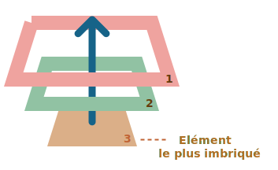
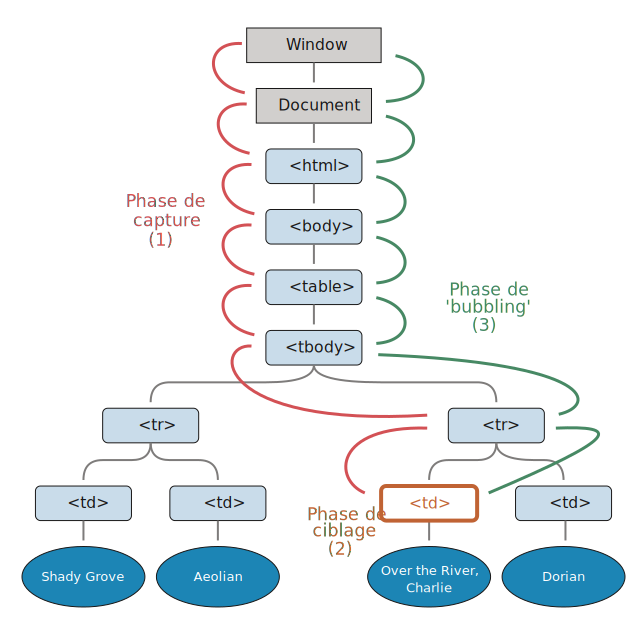

# Bubbling et capture

Commençons par un exemple.

Ce gestionnaire d'événement est assigné au `<div>`, mais s'exécute également si on clique sur l'un des sous-éléments comme `<em>` ou `<code>`:

```html autorun height=60
<div onclick="alert('The handler!')">
  <em>Si on clique sur l'<code>EM</code>, le gestionnaire du <code>DIV</code> s'exécute.</em>
</div>
```

Ce n'est pas un peu étrange ? Pourquoi le gestionnaire du `<div>` s'exécute alors qu'on a cliqué sur l'`<em>`?

## Bubbling (ou "bouillonement")

Le principe du bubbling est simple.

**Quand un événement se produit sur un élément, il exécute d'abord les gestionnaires sur cet élément, puis sur son parent, puis remonte toute la chaîne d'ancêtres.**

Disons qu'on a 3 éléments imbriqués `FORM > DIV > P` qui ont chacun un gestionnaire associé:

```html run autorun
<style>
  body * {
    margin: 10px;
    border: 1px solid blue;
  }
</style>

<form onclick="alert('form')">FORM
  <div onclick="alert('div')">DIV
    <p onclick="alert('p')">P</p>
  </div>
</form>
```

Un clic sur le `<p>` interne exécute `onclick`:
1. Sur ce `<p>`.
2. Puis sur le `<div>`.
3. Puis sur le `<form>` externe.
4. Et continue jusqu'à atteindre l'objet `document`.



Si on clic donc sur `<p>`, on verra 3 alertes: `p` -> `div` -> `form`.

Ce fonctionnement s'appelle bubbling ("bouillonnement"), car les événements remontent petit à petit, comme des bulles dans l'eau.

```warn header="*Presque* tous les événements 'bubble'."
Le mot-clé étant "presque".

Par exemple, un événement `focus` ne bubble pas. Il y a d'autres exemples également, nous y viendrons. Cela reste cependant une exceptio, pas la norme, la majorité des événements 'bubble'.
```

## event.target

Le gestionnaire d'événement sur un parent peut toujours récupérer les détails de la source initiale de l'événement, l'élément où l'événement s'est produit en premier.

**L'élement le plus imbriqué ayant causé l'événement s'appelle l'élément *cible* element, accessible en tant que `event.target`.**

Notez la différence avec `this` (=`event.currentTarget`):

- `event.target` -- C'est l'élément "cible" qui a initié l'événement, il ne change pas au cours du bubbling sur les parents.
- `this` -- C'est l'élément "actuel", celui qui a actuellement un gestionnaire en cours d'exécution.

Par exemple, si on a un seul gestionnaire `form.onclick`, il peut 'attraper" n'importe quel click à l'intérieur du formulaire. Peu importe sur quel sous-élément le clic a eu lieu à l'intérieur du formulaire, il va 'bubble' jusqu'au `<form>` et exécuter son gestionnaire.

Dans un gestionnaire `form.onclick` :

- `this` (=`event.currentTarget`) est l'élément `<form>`, car le gestionnaire s'exécute dessus.
- `event.target` est le 'vrai' élément à l'intérieur du formulaire qui a été cliqué.

Démonstration:

[codetabs height=220 src="bubble-target"]

Il est possible que `event.target` ait la même valeur que `this` -- ça se produit si le clic est fait directement sur l'élément `<form>`.

## Stopper le bubbling

Un événement 'bubbling' remonte de l'élément cible en ligne droite. Normalement, il remonte jusqu'à `<html>`, et ensuite à l'objet `document`, et certains événements atteignent même `window`, en déclenchant tous les gestionnaires sur le chemin.

Mais chaque gestionnaire peut décider que l'événement a été traité complètement, et stopper le 'bubbling'.

La fonction à appeler pour ça est `event.stopPropagation()`.

Ici par exemple, `body.onclick` ne fonctionne pas si on clique sur le `<button>`:

```html run autorun height=60
<body onclick="alert(`le bubbling n'atteint pas cet élément`)">
  <button onclick="event.stopPropagation()">Click me</button>
</body>
```

```smart header="event.stopImmediatePropagation()"
Si un élément a plusieurs gestionnaires pour un même événement, et que l'un d'entre eux stoppe le 'bubbling', les autres gestionnaires s'exécutent quand même.

En d'autres termes, `event.stopPropagation()` bloque seulement la remontée vers les parents, mais tous les gestionnaires s'exécuteront sur l'élément actuel.

Pour stopper le 'bubbling' et empêcher les gestionnaires sur l'élément actuel de s'exécuter, il existe une méthode `event.stopImmediatePropagation()`. Après l'avoir appelée, aucun autre gestionnaire ne s'exécutera.
```

```warn header="Ne stoppez pas le 'bubbling' si ce n'est pas nécessaire!"
Le 'bubbling' est utile, ne le stoppez pas sans en avoir le besoin technique ou architectural.

Parfois, même `event.stopPropagation()` crée des pièges caché qui deviennent des problèmes plus tard.

Par exemple:

1. On crée un menu principal contenant des sous-menus. Chaque sous-menu gère les clics de ses sous-éléments et appelle la méthode `stopPropagation` pour ne pas propager l'événement au menu principal.
2. Plus tard, on décide de traquer tous les clics sur la fenêtre, pour suivre le comportement des utilisateurs (où ils cliquent). Certains systèmes de récolte de données analytiques font exactement ça. Ils utilisent bien souvent `document.addEventListener('click'…)` pour récupérer tous les clics.
3. Nos données analytiques seront manquantes pour la zone de la fenêtre où les clics sont stoppés par `stopPropagation`. Malheureusement, on vient de créer une "zone morte".

Il n'y a généralement pas besoin de bloquer le 'bubbling'. Un problème qui semble nécessiter ce blocage peut très souvent être résolu par d'autres moyens. L'un de ces moyens est d'utiliser des événements personnalisés, que nous verrons plus tard. On peut aussi écrire des données dans l'objet `event` dans un gestionnaire, et les lire depuis un autre gestionnaire; on peut transmettre des données relatives à l'élément cible aux gestionnaires des éléments parents.
```


## Capture

Il y a une autre phase de traitement des événements appelée "capture". Elle est rarement utilisée en pratique, mais peut être utile.

Le standard [Evénements du DOM](https://www.w3.org/TR/DOM-Level-3-Events/) décrit les 3 phases de la propagation d'événement:

1. Phase de capture -- l'événement descend sur l'élément.
2. Phase de ciblage -- l'événement a atteind l'élément cible.
3. Phase de 'bubbling' -- l'événement 'bubble' depuis l'élément.

Voici le schéma de la spécification des phases de capture `(1)`, ciblage `(2)` et 'bubbling' `(3)` pour un événement de clic sur un `<td>` dans une `<table>`:



Pour un clic sur le `<td>`, l'événement traverse d'abord toute la chaîne d'ancêtres jusqu'à l'élément (phase de capture), puis se 'fixe' à la cible et se déclenche ici (phase de ciblage), et enfin il remonte (phase de 'bubbling'), en appelant tous les gestionnaires sur son chemin.

Jusqu'à maintenant, on a parlé que que la phase de 'bubbling', car la phase de capture est rarement utilisée.

En réalité, la phase de capture nous était 'invisible', car les gestionnaires ajoutés via les propriétés `on<event>` ou utilisant les attributs HTML ou utilisant les 2 arguments de `addEventListener(event, handler)` ne savent rien de la phase de capture, ils ne s'exécutent que pendant la 2ème et 3ème phase.

Pour détecter l'événement pendant la phase de capture, on peut mettre l'option `capture` à `true` dans le gestionnaire:

```js
elem.addEventListener(..., {capture: true})

// On peut aussi juste envoyer "true", qui est un alias de {capture: true}
elem.addEventListener(..., true)
```

L'option `capture` a 2 valeurs possibles:

- Si `false` (par défaut), le gestionnaire est défini sur la phase de 'bubbling'.
- Si `true`, le gestionnaire est défini sur la phase de capture.


Notez que même si il y a 3 phases, la 2ème phase ("phase de ciblage": l'événement atteint l'élément) n'est pas géré séparément: les gestionnaires de phases de capture et de 'bubbling' se déclenchent tous les deux pendant cette phase.

Voyons les phases de capture et de 'bubbling' en action:

```html run autorun height=140 edit
<style>
  body * {
    margin: 10px;
    border: 1px solid blue;
  }
</style>

<form>FORM
  <div>DIV
    <p>P</p>
  </div>
</form>

<script>
  for(let elem of document.querySelectorAll('*')) {
    elem.addEventListener("click", e => alert(`Capturing: ${elem.tagName}`), true);
    elem.addEventListener("click", e => alert(`Bubbling: ${elem.tagName}`));
  }
</script>
```

Ce code ajoute un gestionnaire pour les événements "clic" sur *tous* les éléments du document pour voir lesquels fonctionnent.

Si on clique sur `<p>`, la séquence est:

1. `HTML` -> `BODY` -> `FORM` -> `DIV` -> `P` (phase de capture):
2. `P` -> `DIV` -> `FORM` -> `BODY` -> `HTML` (phase de 'bubbling').

Notez que le `P` apparait 2 fois, car on écoute 2 événements: la capture et le 'bubbling'. Le `<p>` cible se déclenche à la fin de la première phase, et au début de la deuxième.

There's a property `event.eventPhase` that tells us the number of the phase on which the event was caught. But it's rarely used, because we usually know it in the handler.

```smart header="To remove the handler, `removeEventListener` needs the same phase"
If we `addEventListener(..., true)`, then we should mention the same phase in `removeEventListener(..., true)` to correctly remove the handler.
```

````smart header="Listeners on the same element and same phase run in their set order"
If we have multiple event handlers on the same phase, assigned to the same element with `addEventListener`, they run in the same order as they are created:

```js
elem.addEventListener("click", e => alert(1)); // guaranteed to trigger first
elem.addEventListener("click", e => alert(2));
```
````

```smart header="The `event.stopPropagation()` during the capturing also prevents the bubbling"
The `event.stopPropagation()` method and its sibling `event.stopImmediatePropagation()` can also be called on the capturing phase. Then not only the futher capturing is stopped, but the bubbling as well.

In other words, normally the event goes first down ("capturing") and then up ("bubbling"). But if `event.stopPropagation()` is called during the capturing phase, then the event travel stops, no bubbling will occur.
```


## Summary

When an event happens -- the most nested element where it happens gets labeled as the "target element" (`event.target`).

- Then the event moves down from the document root to `event.target`, calling handlers assigned with `addEventListener(..., true)` on the way (`true` is a shorthand for `{capture: true}`).
- Then handlers are called on the target element itself.
- Then the event bubbles up from `event.target` to the root, calling handlers assigned using `on<event>`, HTML attributes and `addEventListener` without the 3rd argument or with the 3rd argument `false/{capture:false}`.

Each handler can access `event` object properties:

- `event.target` -- the deepest element that originated the event.
- `event.currentTarget` (=`this`) -- the current element that handles the event (the one that has the handler on it)
- `event.eventPhase` -- the current phase (capturing=1, target=2, bubbling=3).

Any event handler can stop the event by calling `event.stopPropagation()`, but that's not recommended, because we can't really be sure we won't need it above, maybe for completely different things.

The capturing phase is used very rarely, usually we handle events on bubbling. And there's a logical explanation for that.

In real world, when an accident happens, local authorities react first. They know best the area where it happened. Then higher-level authorities if needed.

The same for event handlers. The code that set the handler on a particular element knows maximum details about the element and what it does. A handler on a particular `<td>` may be suited for that exactly `<td>`, it knows everything about it, so it should get the chance first. Then its immediate parent also knows about the context, but a little bit less, and so on till the very top element that handles general concepts and runs the last one.

Bubbling and capturing lay the foundation for "event delegation" -- an extremely powerful event handling pattern that we study in the next chapter.
